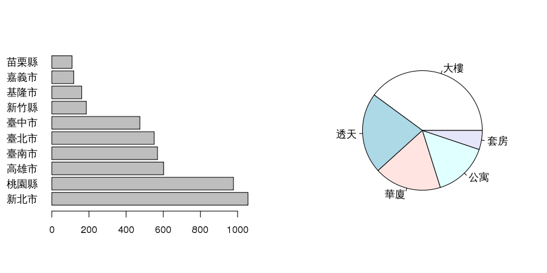

# Purpose 

---
## 趙藤雄被羈押


---
## 合適購屋站
> - 充斥一堆房價資訊，但每個家庭也都有各自的喜好條件
> - simple model: 可以指定理想房屋型態、條件，可以提供你參考的房價
> - Data source：不動產實價登錄資料 ( ~ 2014年5月16日)
> - Predictor variables : 建物面積、所屬縣市、屋齡、行政區域、建物型態
> - 建物型態: 華廈(10層含以下有電梯)、套房(1房1廳1衛)、公寓(5樓含以下無電梯)、大樓(11層含以上有電梯)


---
# Exploratory 

---
## Data Appearance

```r
dat1 <- readRDS("estate1.rds")
nrow(dat1)
```

```
## [1] 5436
```

```r
head(dat1[sample(1:length(dat1),6),])
```

```
##       \xa6\xe6\xacF\xb0\xcf   \xbf\xa4\xa5\xab \xab\xac\xbaA \xa9л\xf9
## 21           \xb8U\xb5ذ\xcf \xbbO\xa5_\xa5\xab \xa4\xbd\xb4J  13750000
## 5  \xa4\xa4\xa5\xbf\xb0\xcf \xbbO\xa5_\xa5\xab        \xb5طH  14650000
## 16    \xa4\xe5\xa4s\xb0\xcf \xbbO\xa5_\xa5\xab        \xb5طH  11800000
## 2     \xa4\xe5\xa4s\xb0\xcf \xbbO\xa5_\xa5\xab        \xb5طH   8450000
## 11    \xa4\xe5\xa4s\xb0\xcf \xbbO\xa5_\xa5\xab \xa4\xbd\xb4J  13500000
## 1     \xa4\xe5\xa4s\xb0\xcf \xbbO\xa5_\xa5\xab \xa4j\xbc\xd3  47500000
##    \xad\xb1\xbfn \xab\xce\xc4\xd6         \xa8\xae\xa6\xec
## 21         22.58               45    \xb5L\xa8\xae\xa6\xec
## 5          20.94               38    \xb5L\xa8\xae\xa6\xec
## 16         24.34               21    \xb5L\xa8\xae\xa6\xec
## 2          21.80               21    \xb5L\xa8\xae\xa6\xec
## 11         25.47               34    \xb5L\xa8\xae\xa6\xec
## 1          80.50                6 \xa6\xb3\xa8\xae\xa6\xec
##            \xba\u07b2z
## 21    \xb5L\xba\u07b2z
## 5     \xb5L\xba\u07b2z
## 16    \xb5L\xba\u07b2z
## 2  \xa6\xb3\xba\u07b2z
## 11 \xa6\xb3\xba\u07b2z
## 1  \xa6\xb3\xba\u07b2z
```

---
## Formula & Description 
- Formula
  * `y ~ x`
  *(欲改成latex) y ~ x $y \sim x$

- Description

```r
summary(dat1)
```

```
##                        \xa6\xe6\xacF\xb0\xcf
##  <ae><e7><b6>饫          : 344              
##  <b2>H<a4><f4><b0><cf>   : 219              
##  <a6><e8><a4>ٰ<cf>         : 160              
##  <b7><a8><b1><f6><a5><ab>: 146              
##  <a4><e5><a4>s<b0><cf>   : 144              
##  <a4><a4><c3>c<a5><ab>   : 137              
##  (Other)                 :4286              
##                        \xbf\xa4\xa5\xab   \xab\xac\xbaA     
##  <b7>s<a5>_<a5><ab>      :1056          \xa4\xbd\xb4J: 815  
##  <ae><e7><b6>\u9fe4      : 978          \xb5طH       : 986  
##  <b0><aa><b6><af><a5><ab>: 604          \xa4j\xbc\xd3:2168  
##  <bb>O<ab>n<a5><ab>      : 570          \xaeM\xa9\xd0: 280  
##  <bb>O<a5>_<a5><ab>      : 551          \xb3z\xa4\xd1:1187  
##  <bb>O<a4><a4><a5><ab>   : 475                              
##  (Other)                 :1202                              
##       \xa9л\xf9          \xad\xb1\xbfn      \xab\xce\xc4\xd6
##  Min.   :5.03e+04   Min.   :  0.3      Min.   : 0.0         
##  1st Qu.:3.55e+06   1st Qu.: 26.2      1st Qu.: 4.0         
##  Median :6.30e+06   Median : 35.8      Median :18.0         
##  Mean   :9.24e+06   Mean   : 40.2      Mean   :16.9         
##  3rd Qu.:1.04e+07   3rd Qu.: 48.9      3rd Qu.:25.0         
##  Max.   :1.55e+08   Max.   :911.4      Max.   :74.0         
##                                                             
##    \xa8\xae\xa6\xec                \xba\u07b2z             
##  \xb5L\xa8\xae\xa6\xec   :3415   \xa6\xb3\xba\u07b2z:3140  
##  \xa6\xb3\xa8\xae\xa6\xec:2021   \xb5L\xba\u07b2z   :2296  
##                                                            
##                                                            
##                                                            
##                                                            
## 
```

---
## Tabulating & Pivot table
- Tabulating

```r
sort(table(dat1[,1]),decreasing = TRUE)[1:5]
```

```
## 
##           \xae\xe7\xb6饫    \xb2H\xa4\xf4\xb0\xcf          \xa6\xe8\xa4ٰ\xcf 
##                      344                      219                      160 
## \xb7\xa8\xb1\xf6\xa5\xab    \xa4\xe5\xa4s\xb0\xcf 
##                      146                      144
```
- Pivot table

```r
library(reshape)
cast(dat1,型態 ~ ., fun.aggregate=mean,value="房價")
```

```
## Error: Casting formula contains variables not found in molten data: 型態
```
---
## It's your turn 1
- 試練習各縣市在不同型態的房屋數量，如何操作?

```r
library(reshape)
cast(dat1,型態 ~ ., fun.aggregate=mean,value="房價")
```

> - Hint: cast + table

---
## Pivot table (Answer1)

```r
cast(dat1,縣市~.,fun.aggregate=table,value="型態")
```

```
## Error: Casting formula contains variables not found in molten data: 縣市
```

---
## Graphic is more intutive

```r
par(mfrow=c(1,2))
barplot(sort(table(dat1$縣市),decreasing=TRUE)[1:10],las=1,horiz=TRUE)
```

```
## Error: need finite 'xlim' values
```

```r
pie(sort(table(dat1$型態),decreasing=TRUE))
```

```
## Error: 'length.out' must be a non-negative number
```

 

---
## It's your turn 2

```r
par(mfrow=c(1,2))
barplot(sort(table(dat1$縣市),decreasing=TRUE)[1:10],las=1,horiz=TRUE)
pie(sort(table(dat1$型態),decreasing=TRUE))
```
- 1. 按型態的barplot是?
- 2. 前五大縣市的pie plot?

---
## Barplot & Pie plot (Ans2)

```r
par(mfrow=c(1,2))
barplot(sort(table(dat1$型態),decreasing=TRUE),las=1,horiz=TRUE)
```

```
## Error: need finite 'xlim' values
```

```r
pie(sort(table(dat1$縣市),decreasing=TRUE)[1:5])
```

```
## Error: 'x' values must be positive.
```

 

---
## ggplot (Visualization)

```r
library(ggplot2)
count <- sort(table(dat1$縣市),decreasing=TRUE)[1:10]
zone <- factor(names(count),levels=names(count),ordered=TRUE)
df <- data.frame(count, zone)
```

```
## Error: arguments imply differing number of rows: 10, 0
```

```r
ggplot(data=df, aes(x=zone,y=count,fill=zone)) + geom_bar(colour="black",stat="identity") + guides(fill=FALSE)
```

```
## Error: ggplot2 doesn't know how to deal with data of class function
```

---
## Histogram 

```r
par(mfrow=c(2,2))
hist(dat1$面積,breaks=5,col="lightblue",prob=TRUE,xlab="面積",main="Historgram")
```

```
## Error: 'x' must be numeric
```

```r
hist(dat1$面積,breaks=100,col="lightgreen",prob=TRUE,xlab="面積",main="Historgram")
```

```
## Error: 'x' must be numeric
```

```r
hist(dat1$房價,breaks=20,col="lightyellow",prob=TRUE,xlab="房價",main="Historgram")
```

```
## Error: 'x' must be numeric
```

```r
hist(dat1$房價,breaks=200,col="lightgray",prob=TRUE,xlab="房價",main="Historgram")
```

```
## Error: 'x' must be numeric
```

---
## Log transformation for ratio data
> - what kind of data: 右偏，如: 芮氏規模地震、分貝、家庭年收入、成本、雨量。
> - even more:  恐怖攻擊造成死亡人數，地震規模每年發生次數。


```r
par(mfrow=c(1,2))
hist(log10(dat1$面積),breaks=20,col="blue",prob=TRUE,xlab="log10(面積)",main="Historgram")
```

```
## Error: non-numeric argument to mathematical function
```

```r
hist(log10(dat1$房價),breaks=30,col="green",prob=TRUE,xlab="log10(房價)",main="Historgram")
```

```
## Error: non-numeric argument to mathematical function
```

---
## It's your turn 3

```r
par(mfrow=c(2,2))
hist(dat1$面積,breaks=5,col="lightblue",prob=TRUE,xlab="面積",main="Historgram")
hist(dat1$面積,breaks=20,col="lightgreen",prob=TRUE,xlab="面積",main="Historgram")
hist(log10(dat1$面積),breaks=5,col="blue",prob=TRUE,xlab="log10(面積)",main="Historgram")
hist(log10(dat1$面積),breaks=20,col="green",prob=TRUE,xlab="log10(面積)",main="Historgram")
```
- 房價(單位百萬)直方圖, log房價(單位百萬)直方圖

> - HINT: 房價單位百萬，寬度調小

---
## Histogram (Ans3)

```r
par(mfrow=c(1,2))
hist(dat1$房價/10^6,breaks=100,col="lightpink",prob=TRUE,xlab="房價(百萬)",main="Historgram")
```

```
## Error: character(0)
```

```r
hist(log10(dat1$房價),breaks=20,col="deeppink",prob=TRUE,xlab="log10(房價)",main="Historgram")
```

```
## Error: non-numeric argument to mathematical function
```

---
## Boxplot 
|----------------|----------|
| median : 中位數            |  IQR : interquantile range|
|range(Q1-1.5IQR,Q3+1.5IQR)  | outlier |


```r
boxplot(面積~型態,data=subset(dat1,縣市=="臺北市"),ylab="面積(坪)",main="面積")
```

```
## Error: object '縣市' not found
```

---
## It's your turn 4
- 請繪製有五都("臺北市","新北市","臺中市","高雄市","臺南市") 透天 log10(房價) 和 套房 log10(房價)的boxplot 各一張  

```r
boxplot(面積~型態,data=subset(dat1,縣市=="臺北市"),ylab="面積(坪)",main="面積")
```

> - HINT:
<b>
dat2 <- dat1[dat1$縣市 %in% c("臺北市","臺中市","新北市","臺南市","高雄市") ,]
dat2$縣市 <- factor(dat2$縣市,levels=c("臺北市","臺中市","新北市","臺南市","高雄市"))
</b>

---
## Boxplot (Ans4)

```r
par(mfrow=c(1,2))
dat2 <- dat1[dat1$縣市 %in% c("臺北市","臺中市","新北市","臺南市","高雄市") ,]
dat2$縣市 <- factor(dat2$縣市,levels=c("臺北市","臺中市","新北市","臺南市","高雄市"))
boxplot(log10(房價)~縣市,data=subset(dat2,型態=="透天"),las=2,ylab="log10(房價)",main="透天")
```

```
## Error: object '型態' not found
```

```r
boxplot(log10(房價)~縣市,data=subset(dat2,型態=="套房"),las=2,ylab="log10(房價)",main="套房")
```

```
## Error: object '型態' not found
```

---
# Regression

---
## Variables

- $y$: response ,explained variable, dependent variable, predictand. 如: 房價、雨量
- $x$: predictor, independnet variable... 如: (面積,型態)、(溫度、風速、氣壓)

---
## Scatter plot

```r
par(mfrow=c(1,2))
plot(dat1$面積,dat1$房價/10^4,xlab="面積(坪)",ylab="房價(萬元)")
```

```
## Error: need finite 'xlim' values
```

```r
plot(dat1$面積,dat1$房價/10^4,xlab="log面積(坪)",ylab="log房價(萬元)",log="xy")
```

```
## Error: need finite 'xlim' values
```

 

---
## Simple regression 

```r
x <- dat1$面積
y <- dat1$房價/10^4
c(cor(x,y),cor(log10(x),log10(y)))
```

```
## Error: 'x' must be numeric
```

```r
plot(x,y,xlab="面積(坪)",ylab="房價(萬元)",log="xy")
```

```
## Error: need finite 'xlim' values
```

 

```r
fit <- lm(log10(y)~log10(x))
```

```
## Error: non-numeric argument to mathematical function
```

```r
abline(fit,col=2,lwd=2)
```

```
## Error: object 'fit' not found
```

---
## Simple regression - model output

```r
summary(fit)
```

```
## Error: object 'fit' not found
```

---
## It's your turn 5

```r
x <- dat1$面積
y <- dat1$房價/10^4
c(cor(x,y),cor(log10(x),log10(y)))
plot(x,y,xlab="面積(坪)",ylab="房價(萬元)",log="xy")
fit <- lm(log10(y)~log10(x))
abline(fit,col=2,lwd=2)
```
- 試作 臺北市房價 簡單回歸模型

---
## Simple regression (Ans5)

```r
dat3 <- dat1[dat1$縣市=="臺北市",]
x <- dat3$面積-y <- dat3$房價/10^4
plot(x,y,log="xy");fit<-lm(log10(y)~log10(x))
```

```
## Error: need finite 'xlim' values
```

 

```
## Error: non-numeric argument to mathematical function
```

```r
abline(fit,col=2)
```

```
## Error: object 'fit' not found
```

```r
legend("topleft",legend=round(summary(fit)$r.squared,4),title="r.squared")
```

```
## Error: object 'fit' not found
```

---
## Multiple regression  - Category variable

```r
library(ggplot2)
dat4 <- dat1
names(dat4) <- c("admin","zone","type","price","area","age","parking","maintance")
qplot(area,price,data=dat4,log="xy") + geom_smooth(method="lm") + facet_grid(parking ~ maintance)
```

 

---
## Category Variable

```r
m11 <- lm(log10(房價)~面積+屋齡+型態+車位+管理, data=dat1)
```

```
## Error: object '房價' not found
```

```r
m12 <- lm(log10(房價)~面積+屋齡+型態+車位+管理+行政區+縣市, data=dat1)
```

```
## Error: object '房價' not found
```

```r
summary(m11)
```

```
## Error: object 'm11' not found
```

---
## It's your turn 6 

```r
m11 <- lm(log10(房價)~面積+屋齡+型態+車位+管理, data=dat1)
m12 <- lm(log10(房價)~面積+屋齡+型態+車位+管理+行政區+縣市, data=dat1)
summary(m11)
```
- 試建立臺北市 multiple regression(predictor: 分別多行政區與縣市)，並找出R.squared

---
## Multiple regression & category variable-1 (Ans6)-1

```r
m21 <- lm(log10(房價)~面積+屋齡+型態+車位+管理, data=dat3)
```

```
## Error: object '房價' not found
```

```r
m22 <- lm(log10(房價)~面積+屋齡+型態+車位+管理+行政區, data=dat3)
```

```
## Error: object '房價' not found
```

```r
# R-squared, 越趨近1模型解釋能力越好
data.frame("m11"=summary(m11)$r.sq, "m12"=summary(m12)$r.sq, "m21"=summary(m21)$r.sq, "m22"=summary(m22)$r.sq)
```

```
## Error: object 'm11' not found
```

---
## Multiple regression & category variable-1 (Ans6)-2

```r
summary(m21)
```

```
## Error: object 'm21' not found
```

---
## Multiple regression & category variable-1 (Ans6)-3

```r
summary(m22)
```

```
## Error: object 'm22' not found
```

---
## Forecasting

```r
head(dat1,n=3)
```

```
##      \xa6\xe6\xacF\xb0\xcf   \xbf\xa4\xa5\xab \xab\xac\xbaA \xa9л\xf9
## 1    \xa4\xe5\xa4s\xb0\xcf \xbbO\xa5_\xa5\xab \xa4j\xbc\xd3  47500000
## 2    \xa4\xe5\xa4s\xb0\xcf \xbbO\xa5_\xa5\xab        \xb5طH   8450000
## 5 \xa4\xa4\xa5\xbf\xb0\xcf \xbbO\xa5_\xa5\xab        \xb5طH  14650000
##   \xad\xb1\xbfn \xab\xce\xc4\xd6         \xa8\xae\xa6\xec
## 1         80.50                6 \xa6\xb3\xa8\xae\xa6\xec
## 2         21.80               21    \xb5L\xa8\xae\xa6\xec
## 5         20.94               38    \xb5L\xa8\xae\xa6\xec
##           \xba\u07b2z
## 1 \xa6\xb3\xba\u07b2z
## 2 \xa6\xb3\xba\u07b2z
## 5    \xb5L\xba\u07b2z
```

```r
forecast <- dat1[1:5, c(1,2,3,5,6,7,8)]
rownames(forecast) <- 1:5
forecast$面積 <- c(30,30,8,40,40)
forecast$行政區 <- c("萬華區","大安區","信義區","中山區","南港區")
forecast$屋齡 <- c(30,6,6,8,8)
forecast$車位 <- c("無車位","有車位","無車位","有車位","有車位")
forecast$管理 <- c("無管理","有管理","無管理","有管理","有管理")
forecast$型態 <- c("公寓","大樓","套房","大樓","透天")
forecast$縣市 <- rep("臺北市",5)
forecast
```

```
##      \xa6\xe6\xacF\xb0\xcf   \xbf\xa4\xa5\xab \xab\xac\xbaA \xad\xb1\xbfn
## 1    \xa4\xe5\xa4s\xb0\xcf \xbbO\xa5_\xa5\xab \xa4j\xbc\xd3         80.50
## 2    \xa4\xe5\xa4s\xb0\xcf \xbbO\xa5_\xa5\xab        \xb5طH         21.80
## 3 \xa4\xa4\xa5\xbf\xb0\xcf \xbbO\xa5_\xa5\xab        \xb5طH         20.94
## 4    \xa4\xe5\xa4s\xb0\xcf \xbbO\xa5_\xa5\xab \xa4\xbd\xb4J         26.24
## 5    \xa4\xe5\xa4s\xb0\xcf \xbbO\xa5_\xa5\xab \xa4\xbd\xb4J         30.35
##   \xab\xce\xc4\xd6         \xa8\xae\xa6\xec         \xba\u07b2z 面積
## 1                6 \xa6\xb3\xa8\xae\xa6\xec \xa6\xb3\xba\u07b2z   30
## 2               21    \xb5L\xa8\xae\xa6\xec \xa6\xb3\xba\u07b2z   30
## 3               38    \xb5L\xa8\xae\xa6\xec    \xb5L\xba\u07b2z    8
## 4               31    \xb5L\xa8\xae\xa6\xec \xa6\xb3\xba\u07b2z   40
## 5               40    \xb5L\xa8\xae\xa6\xec    \xb5L\xba\u07b2z   40
##   行政區 屋齡   車位   管理 型態   縣市
## 1 萬華區   30 無車位 無管理 公寓 臺北市
## 2 大安區    6 有車位 有管理 大樓 臺北市
## 3 信義區    6 無車位 無管理 套房 臺北市
## 4 中山區    8 有車位 有管理 大樓 臺北市
## 5 南港區    8 有車位 有管理 透天 臺北市
```

```r
# prediction
#tmp <- predict(m12, newdata=forecast, se.fit=TRUE)
#pred <- 10^cbind(tmp$fit, tmp$fit-tmp$se.fit, tmp$fit+tmp$se.fit)
#data.frame("建案坪數"=forecast$面積, "建物型態"=forecast$型態, 
#           "總價估計.萬元"=round(pred[,1]/10000),
#           "單價估計.萬元"=round(pred[,1]/10000/forecast$面積))
```

---
## It's your trun 7

```r
forecast <- dat1[1:5, c(1,2,3,5,6,7,8)]
rownames(forecast) <- 1:5
forecast$面積 <- c(30,30,8,40,40)
forecast$行政區 <- c("萬華區","大安區","信義區","中山區","南港區")
forecast$屋齡 <- c(30,6,6,8,8)
forecast$車位 <- c("車位無","車位有","車位無","車位有","車位有")
forecast$管理 <- c("管理無","管理有","管理無","管理有","管理有")
forecast$型態 <- c("公寓","大樓","套房","大樓","透天")
forecast$縣市 <- rep("臺北市",5)
# prediction
tmp <- predict(m12, newdata=forecast, se.fit=TRUE)
pred <- 10^cbind(tmp$fit, tmp$fit-tmp$se.fit, tmp$fit+tmp$se.fit)
data.frame("建案坪數"=forecast$面積, "建物型態"=forecast$型態, 
           "總價估計.萬元"=round(pred[,1]/10000),
           "單價估計.萬元"=round(pred[,1]/10000/forecast$面積))
```
- 試練習直接使用臺北市資料所建立之模型，作以上預測。

---
## Forecasting (Ans7)

```r
head(dat3)
```

```
## [1] \xa6\xe6\xacF\xb0\xcf \xbf\xa4\xa5\xab      \xab\xac\xbaA        
## [4] \xa9л\xf9             \xad\xb1\xbfn         \xab\xce\xc4\xd6     
## [7] \xa8\xae\xa6\xec      \xba\u07b2z          
## <0 rows> (or 0-length row.names)
```

```r
forecast <- dat3[1:5, c(1,3,5,6,7,8)]
rownames(forecast) <- 1:5
forecast$面積 <- c(30,30,8,40,40)
forecast$行政區 <- c("萬華區","大安區","信義區","中山區","南港區")
forecast$屋齡 <- c(30,6,6,8,8)
forecast$車位 <- c("車位無","車位有","車位無","車位有","車位有")
forecast$管理 <- c("管理無","管理有","管理無","管理有","管理有")
forecast$型態 <- c("公寓","大樓","套房","大樓","透天")
# prediction
forecast;m12
```

```
##   \xa6\xe6\xacF\xb0\xcf \xab\xac\xbaA \xad\xb1\xbfn \xab\xce\xc4\xd6
## 1                  <NA>          <NA>            NA               NA
## 2                  <NA>          <NA>            NA               NA
## 3                  <NA>          <NA>            NA               NA
## 4                  <NA>          <NA>            NA               NA
## 5                  <NA>          <NA>            NA               NA
##   \xa8\xae\xa6\xec \xba\u07b2z 面積 行政區 屋齡   車位   管理 型態
## 1             <NA>        <NA>   30 萬華區   30 車位無 管理無 公寓
## 2             <NA>        <NA>   30 大安區    6 車位有 管理有 大樓
## 3             <NA>        <NA>    8 信義區    6 車位無 管理無 套房
## 4             <NA>        <NA>   40 中山區    8 車位有 管理有 大樓
## 5             <NA>        <NA>   40 南港區    8 車位有 管理有 透天
```

```
## Error: object 'm12' not found
```

```
##   \xa6\xe6\xacF\xb0\xcf \xab\xac\xbaA \xad\xb1\xbfn \xab\xce\xc4\xd6
## 1                  <NA>          <NA>            NA               NA
## 2                  <NA>          <NA>            NA               NA
## 3                  <NA>          <NA>            NA               NA
## 4                  <NA>          <NA>            NA               NA
## 5                  <NA>          <NA>            NA               NA
##   \xa8\xae\xa6\xec \xba\u07b2z 面積 行政區 屋齡   車位   管理 型態
## 1             <NA>        <NA>   30 萬華區   30 車位無 管理無 公寓
## 2             <NA>        <NA>   30 大安區    6 車位有 管理有 大樓
## 3             <NA>        <NA>    8 信義區    6 車位無 管理無 套房
## 4             <NA>        <NA>   40 中山區    8 車位有 管理有 大樓
## 5             <NA>        <NA>   40 南港區    8 車位有 管理有 透天
```

```r
#tmp <- predict(m22, newdata=forecast, se.fit=TRUE)
#pred <- 10^cbind(tmp$fit, tmp$fit-tmp$se.fit, tmp$fit+tmp$se.fit)
#data.frame("建案坪數"=forecast$面積, "建物型態"=forecast$型態, 
#           "總價估計.萬元"=round(pred[,1]/10000),
#           "單價估計.萬元"=round(pred[,1]/10000/forecast$面積))
```

---
# Data Mining - Dicision Tree

---
## Dicision Tree

```r
library(rpart)
dat3$房價百萬 <- dat3$房價/10^6
fit <- rpart(型態~面積+車位+管理+屋齡+房價百萬,data=dat3)
```

```
## Error: object '型態' not found
```

```r
library(rpart.plot)
prp(fit,extra=1)
```

```
## Error: object 'fit' not found
```

---
## It's your turn 8

```r
library(rpart)
dat3$房價百萬 <- dat3$房價/10^6
fit <- rpart(型態~面積+車位+管理+屋齡+房價百萬,data=dat3)
library(rpart.plot)
prp(fit,extra=1)
```
- 試練習五都 Disicion Tree

---
## Dicision Tree (Ans8)

```r
dat2$房價百萬 <- dat2$房價/10^6
fit2 <- rpart(縣市~型態+面積+屋齡+房價百萬,data=dat2)
```

```
## Error: object '型態' not found
```

```r
prp(fit2,extra=1)
```

```
## Error: object 'fit2' not found
```

---
# Future

---
## 進階課程內容
* GAM(Generalized Additive Model): nonlinear parameter for nonlinear model
  * 進階模型配適
* Overfitting:
  * 模型是否預測準確? (Cross Validation, model selection critera)

* Evaluation: 
  * 校驗模型準確性(RMSE,MAE,Recall & Recall)

---
# non-linear coefficent(補充)

---
## GAM model

```r
library(mgcv) # provides functions for generalized additive modelling
# fit linear model
m31 <- lm(log10(房價)~面積+車位+屋齡+縣市+型態+行政區, data=dat1)
```

```
## Error: object '房價' not found
```

```r
# fit addiive model with two smooth terms
m32 <- gam(log10(房價)~s(面積)+車位+s(屋齡)+縣市+型態+行政區, data=dat1)
```

```
## Error: object '房價' not found
```

```r
# Compare adjusted R-squared, 越趨近1模型配適度越好
data.frame("linear model"=summary(m31)$r.sq,"additive model"=summary(m32)$r.sq)
```

```
## Error: object 'm31' not found
```

---
## GAM model parameter : smoothing parameter

```r
par(cex=1.2, mfrow=c(1,2))
plot(m32, select=1, lwd=2) 
```

```
## Error: object 'm32' not found
```

```r
abline(h=m31$coefficients[["面積"]], lwd=2, col=2)
```

```
## Error: object 'm31' not found
```

```r
legend("topleft", c("Smooth term", "Linear term"), col=1:2, lty=1, lwd=2, bty="n")
```

```
## Error: plot.new has not been called yet
```

```r
plot(m32, select=2, lwd=2)
```

```
## Error: object 'm32' not found
```

```r
abline(h=m31$coefficients[["屋齡"]], lwd=2, col=2)
```

```
## Error: object 'm31' not found
```

---
## Compare Multiple regression and GAM model Answer

```r
library(mgcv) # provides functions for generalized additive modelling
# fit linear model
m_new1 <- lm(log10(房價)~面積+車位+屋齡+型態+行政區+縣市, data=dat1)
```

```
## Error: object '房價' not found
```

```r
# fit addiive model with two smooth terms
m_new2 <- gam(log10(房價)~s(面積)+車位+s(屋齡)+型態+行政區+縣市, data=dat1)
```

```
## Error: object '房價' not found
```

```r
# Compare adjusted R-squared, 越趨近1模型配適度越好
data.frame("linear model"=summary(m_new1)$adj.r.sq, "additive model"=summary(m_new2)$r.sq)
```

```
## Error: object 'm_new1' not found
```

---
## It's your turn 7+1

```r
library(mgcv) # provides functions for generalized additive modelling
# fit linear model
m_new1 <- lm(log10(房價)~面積+車位+屋齡+型態+行政區+縣市, data=dat1)
# fit addiive model with two smooth terms
m_new2 <- gam(log10(房價)~s(面積)+車位+s(屋齡)+型態+行政區+縣市, data=dat1)
# Compare adjusted R-squared, 越趨近1模型配適度越好
data.frame("linear model"=summary(m_new1)$adj.r.sq, "additive model"=summary(m_new2)$r.sq)
```
- 試比較臺北市lm與gam模型，參數同上

---
## Multiple regression & GAM (Ans7+1)

```r
library(mgcv) # provides functions for generalized additive modelling
# fit linear model
m_new1_taip <- lm(log10(房價)~面積+車位+屋齡+型態+行政區, data=dat3)
```

```
## Error: object '房價' not found
```

```r
# fit addiive model with two smooth terms
m_new2_taip <- gam(log10(房價)~s(面積)+車位+s(屋齡)+型態+行政區, data=dat3)
```

```
## Error: object '房價' not found
```

```r
# Compare adjusted R-squared, 越趨近1模型配適度越好
data.frame("linear model"=summary(m_new1_taip)$adj.r.sq, "additive model"=summary(m_new2_taip)$r.sq)
```

```
## Error: object 'm_new1_taip' not found
```

