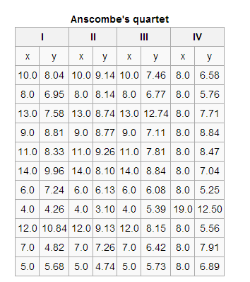
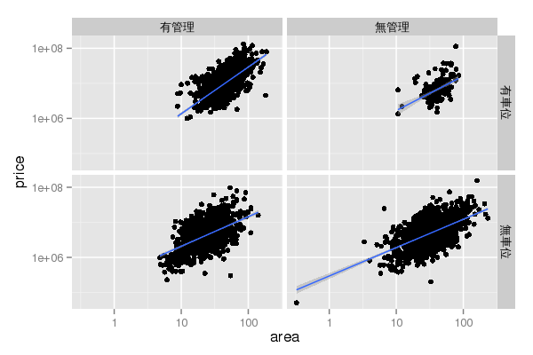

## 合適購屋站
> - 充斥一堆房價資訊，但每個家庭也都有各自的喜好條件
> - simple model: 可以指定理想房屋型態、條件，可以提供你參考的房價
> - Data source：不動產實價登錄資料 ( ~ 2014年5月16日)
> - Predictor variables : 建物面積、所屬縣市、屋齡、行政區域、建物型態
> - 建物型態: 華廈(10層含以下有電梯)、套房(1房1廳1衛)、公寓(5樓含以下無電梯)、大樓(11層含以上有電梯)


--- .segue .dark 
## Exploratory 

---
## Data Appearance

```r
dat1 <- readRDS("estate_linux.rds")
nrow(dat1)
```

```
[1] 5431
```

```r
# random sampling
head(dat1[sample(1:nrow(dat1),6),])
```

```
            行政區   縣市 型態     房價  面積 屋齡   車位   管理
5049  高雄市三民區 高雄市 大樓 11600000 52.98    1 有車位 有管理
11332 桃園縣桃園市 桃園縣 公寓  2750000 23.89   30 無車位 無管理
6032  高雄市大寮區 高雄市 透天  3500000 23.72   37 無車位 無管理
1460  臺中市西屯區 臺中市 套房  1110000  9.26   23 無車位 有管理
1103  臺北市北投區 臺北市 公寓 11000000 39.20   24 無車位 無管理
11974 嘉義市嘉義市 嘉義市 大樓  4400000 56.39   10 無車位 無管理
```

---

```r
head(dat1[sample(1:nrow(dat1),18),],18)
```

```
            行政區   縣市 型態     房價 面積 屋齡   車位   管理
15383 屏東縣枋寮鄉 屏東縣 透天  3800000 45.3    4 無車位 無管理
10532 桃園縣八德市 桃園縣 大樓  8500000 50.2    1 有車位 有管理
6084  高雄市鳳山區 高雄市 大樓  3000000 46.2   19 無車位 有管理
11596 桃園縣桃園市 桃園縣 大樓  7890000 36.9    1 有車位 有管理
9034  新北市淡水區 新北市 大樓 13500000 27.2    7 有車位 有管理
10984 桃園縣蘆竹鄉 桃園縣 華廈  7650000 38.9   14 有車位 有管理
1035  臺北市士林區 臺北市 套房 16200000 17.0    6 無車位 有管理
8116  新北市中和區 新北市 公寓 15500000 37.7   25 有車位 有管理
10435 桃園縣蘆竹鄉 桃園縣 大樓  7100000 44.3   19 有車位 有管理
1499  臺中市西屯區 臺中市 大樓  3150000 23.9   19 無車位 有管理
8804  新北市淡水區 新北市 大樓 11400000 47.9    0 有車位 有管理
2460  臺中市西屯區 臺中市 大樓  9500000 33.9    7 有車位 有管理
12194 新竹縣竹北市 新竹縣 大樓 26800000 97.3    1 有車位 有管理
9308  宜蘭縣員山鄉 宜蘭縣 華廈  2950000 34.6   20 有車位 無管理
1267  臺北市文山區 臺北市 套房  9380000 18.2    4 有車位 有管理
4198    臺南市南區 臺南市 華廈  3660000 31.0   17 有車位 有管理
12031 新竹縣竹北市 新竹縣 華廈  5350000 25.0    1 有車位 有管理
15517 花蓮縣花蓮市 花蓮縣 透天  3100000 30.2   34 無車位 無管理
```

---
## Description 

```r
summary(dat1)
```

```
          行政區          縣市        型態           房價               面積            屋齡     
 桃園縣桃園市: 344   新北市 :1056   公寓: 814   Min.   :5.03e+04   Min.   :  0.3   Min.   : 0.0  
 新北市淡水區: 219   桃園縣 : 978   大樓:2167   1st Qu.:3.55e+06   1st Qu.: 26.2   1st Qu.: 4.0  
 臺中市西屯區: 160   高雄市 : 602   套房: 280   Median :6.30e+06   Median : 35.7   Median :18.0  
 桃園縣楊梅市: 146   臺南市 : 569   華廈: 985   Mean   :9.22e+06   Mean   : 39.7   Mean   :16.9  
 臺北市文山區: 144   臺北市 : 551   透天:1185   3rd Qu.:1.03e+07   3rd Qu.: 48.8   3rd Qu.:25.0  
 桃園縣中壢市: 137   臺中市 : 474               Max.   :1.55e+08   Max.   :232.8   Max.   :74.0  
 (Other)     :4281   (Other):1201                                                                
     車位          管理     
 有車位:2020   有管理:3140  
 無車位:3411   無管理:2291  
                            
                            
                            
                            
                            
```

--- 
## Tabulating

```r
# tabulating
sort(table(dat1[,1]),decreasing = TRUE)[1:5]
```

```

桃園縣桃園市 新北市淡水區 臺中市西屯區 桃園縣楊梅市 臺北市文山區 
         344          219          160          146          144 
```

---
## Formula & Pivot table
- $y \sim x$

```r
# pivotal table
library(reshape);
cast(data=dat1,formula=型態 ~ ., fun.aggregate=mean,value="房價")
```

```
  型態    (all)
1 公寓  7007017
2 大樓 12241661
3 套房  3564414
4 華廈  7625996
5 透天  7863983
```

---
## It's your turn 1
- 試練習各縣市在不同型態的房屋數量，如何操作?

```r
library(reshape)
cast(dat1,型態 ~ ., fun.aggregate=mean,value="房價")
```

> - Hint: cast + table

---

```r
# Pivot table (Ans1)
cast(dat1,縣市~.,fun.aggregate=table,value="型態")
```

```
     縣市 公寓 大樓 套房 華廈 透天
1  南投縣    2    3    1    5   29
2  嘉義市    9   33    5   24   47
3  嘉義縣    3    1    0    2   22
4  基隆市   84   33   10   27    7
5  宜蘭縣   11    8   16   34   35
6  屏東縣    9    4    5   12   77
7  彰化縣    8    5    1   15   64
8  新北市  288  493   75  166   34
9  新竹市   12   18    4   21    4
10 新竹縣    4  109    0   38   35
11 桃園縣   73  596   29  181   99
12 澎湖縣    0    0    0    0    1
13 臺中市   41  216   51   79   87
14 臺北市  146  234   47  114   10
15 臺南市   43  104   16  108  298
16 臺東縣    3    0    1    3   20
17 花蓮縣   12    5    5   28   55
18 苗栗縣    9    8    0   49   43
19 金門縣    0    0    0    0    1
20 雲林縣    0    4    0   12   46
21 高雄市   57  293   14   67  171
```

---
## Graphic is more intutive

```r
par(mfrow=c(1,2))
barplot(sort(table(dat1$縣市),decreasing=TRUE)[1:10],las=1,horiz=TRUE)
pie(sort(table(dat1$型態),decreasing=TRUE))
```

<div class="rimage center"></div>

---
## It's your turn 2

```r
par(mfrow=c(1,2))
barplot(sort(table(dat1$縣市),decreasing=TRUE)[1:10],las=1,horiz=TRUE)
pie(sort(table(dat1$型態),decreasing=TRUE))
```
- 1. 按型態的barplot是?
- 2. 前五大縣市的pie plot?

---

```r
# Barplot & Pie plot (Ans2)
par(mfrow=c(1,2))
barplot(sort(table(dat1$型態),decreasing=TRUE),las=1,horiz=TRUE)
pie(sort(table(dat1$縣市),decreasing=TRUE)[1:5])
```

<div class="rimage center"></div>

---
## ggplot (Data Visualization)
<a class='example'>Visualization</a>

```r
library(ggplot2);count <- sort(table(dat1$縣市),decreasing=TRUE)[1:10]
zone <- factor(names(count),levels=names(count),ordered=TRUE)
df <- data.frame(count, zone)
ggplot(data=df, aes(x=zone,y=count,fill=zone)) + 
  geom_bar(colour="black",stat="identity") + guides(fill=FALSE)
```

<div class="rimage center"></div>

---
## the shaple of data:Histogram -1

```r
par(mfrow=c(1,2))
hist(dat1$面積,breaks=5,col="lightblue",prob=TRUE,xlab="面積",main="Historgram")
hist(dat1$面積,breaks=100,col="lightgreen",prob=TRUE,xlab="面積",main="Historgram")
```

<div class="rimage center"></div>

---
## becareful break argument : Histogram-2
<div class="rimage center"></div>

---
## Histogram  -3

```r
par(mfrow=c(1,2))
hist(dat1$房價/10^6,breaks=20,col="lightyellow",prob=TRUE,xlab="房價(百萬)",main="Historgram")
hist(dat1$房價/10^6,breaks=200,col="lightgray",prob=TRUE,xlab="房價(百萬)",main="Historgram")
```

<div class="rimage center"></div>

--- &twocol
## Log transformation for ratio data -1
> - what kind of data: 右偏，如: 芮氏規模地震、分貝、家庭年收入、成本、雨量。
> - even more:  恐怖攻擊造成死亡人數，地震規模每年發生次數。

*** {name: left}

*** {name: right}
<div class="rimage center"></div>

---
## Log transformation for ratio data -2

```r
par(mfrow=c(1,2))
plot(rev(2:8),log10(frequency),type="l",main="earthquake scale frequency take log")
hist(log10(dat1$面積),breaks=20,col="blue",prob=TRUE,xlab="log10(面積)",main="Historgram")
```

<div class="rimage center"></div>

---
## It's your turn 3

```r
hist(dat1$面積,breaks=100,col="lightgreen",prob=TRUE,xlab="面積",main="Historgram")
hist(log10(dat1$面積),breaks=5,col="blue",prob=TRUE,xlab="log10(面積)",main="Historgram")
```
- 房價(單位百萬)直方圖, log房價(單位百萬)直方圖

> - HINT: 房價單位百萬，寬度調小

---

```r
# Histogram (Ans3)
par(mfrow=c(1,2))
hist(dat1$房價/10^6,breaks=100,col="lightpink",prob=TRUE,xlab="房價(百萬)",main="Historgram")
hist(log10(dat1$房價),breaks=20,col="deeppink",prob=TRUE,xlab="log10(房價)",main="Historgram")
```

<div class="rimage center"></div>

---
## descriptive statistics : Boxplot 
median : 中位數            | IQR : interquantile range 
---------------------------|------------------------------
range(Q1-1.5IQR,Q3+1.5IQR) | outlier 

```r
boxplot(面積~型態,data=subset(dat1,縣市=="臺北市"),ylab="面積(坪)",main="面積")
```

<div class="rimage center"></div>

---
## It's your turn 4
- 請繪製有五都`c("臺北市","新北市","臺中市","高雄市","臺南市")` 透天 log10(房價) 和套房 log10(房價)的boxplot 各一張  

```r
boxplot(面積~型態,data=subset(dat1,縣市=="臺北市"),ylab="面積(坪)",main="面積")
```
- HINT:

```r
dat2 <- dat1[dat1$縣市 %in% c("臺北市","臺中市","新北市","臺南市","高雄市") ,]
dat2$縣市 <- factor(dat2$縣市,levels=c("臺北市","臺中市","新北市","臺南市","高雄市"))
```

---

```r
# Boxplot (Ans4)
dat2 <- dat1[dat1$縣市 %in% c("臺北市","臺中市","新北市","臺南市","高雄市") ,]
dat2$縣市 <- factor(dat2$縣市,levels=c("臺北市","臺中市","新北市","臺南市","高雄市"))
boxplot(log10(房價)~縣市,data=subset(dat2,型態=="透天"),las=2,ylab="log10(房價)",main="透天")
boxplot(log10(房價)~縣市,data=subset(dat2,型態=="套房"),las=2,ylab="log10(房價)",main="套房")
```
<div class="rimage center"></div>

--- .segue .dark 
## Modeling method: Regression

--- &twocol
## what do you see ?
- http://en.wikipedia.org/wiki/Anscombe's_quartet

*** =left
> - 

*** =right
> - 

--- 
## Be careful to use numeber


---
## first step : Scatter plot

```r
par(mfrow=c(1,2))
plot(dat1$面積,dat1$房價/10^4,xlab="面積(坪)",ylab="房價(萬元)")
plot(dat1$面積,dat1$房價/10^4,xlab="log面積(坪)",ylab="log房價(萬元)",log="xy")
```

<div class="rimage center"></div>

--- .centrepre
## Discovery pattern

九大行星半徑(R)與週期(T)關係圖


--- &twocol
## Correlation Coefficient
*** =left

```r
x <- dat1$面積
y <- dat1$房價/10^4
c(cor(x,y),cor(log10(x),log10(y)))
```

```
[1] 0.544 0.613
```

*** =right
  - Correlation coefficient by wiki
  
  

---
## Simple regression

```r
plot(x,y,xlab="面積(坪)",ylab="房價(萬元)",log="xy")
fit <- lm(log10(y)~log10(x))
abline(fit,col=2,lwd=2)
```

<div class="rimage center"></div>


---

```r
summary(fit)
```

```

Call:
lm(formula = log10(y) ~ log10(x))

Residuals:
    Min      1Q  Median      3Q     Max 
-1.5112 -0.1988 -0.0222  0.1884  1.3239 

Coefficients:
            Estimate Std. Error t value Pr(>|t|)    
(Intercept)   1.2479     0.0274    45.6   <2e-16 ***
log10(x)      1.0032     0.0176    57.1   <2e-16 ***
---
Signif. codes:  0 '***' 0.001 '**' 0.01 '*' 0.05 '.' 0.1 ' ' 1

Residual standard error: 0.3 on 5429 degrees of freedom
Multiple R-squared:  0.375,	Adjusted R-squared:  0.375 
F-statistic: 3.26e+03 on 1 and 5429 DF,  p-value: <2e-16
```

---
## It's your turn 5

```r
x <- dat1$面積
y <- dat1$房價/10^4
c(cor(x,y),cor(log10(x),log10(y)))
plot(x,y,xlab="面積(坪)",ylab="房價(萬元)",log="xy")
fit <- lm(log10(y)~log10(x))
abline(fit,col=2,lwd=2)
```
- 試作 臺北市房價 簡單回歸模型

---


```r
# Simple regression (Ans5)
dat3 <- dat1[dat1$縣市=="臺北市",]
x <- dat3$面積-y <- dat3$房價/10^4
plot(x,y,log="xy");fit<-lm(log10(y)~log10(x))
abline(fit,col=2)
legend("topleft",legend=round(summary(fit)$r.squared,4),title="r.squared")
```

<div class="rimage center"></div>


---
## Multiple regression - Variables

- $y$: response ,explained variable, dependent variable, predictand. 如: 房價、雨量
- $x$: predictor, independnet variable... 如: (面積,型態)、(溫度、風速、氣壓)

> - 

> - $$ 房價 \sim 面積 + 屋齡 + 建物型態 + 行政區 + ...$$ 


---
## Multiple regression  - Category variable

```r
library(ggplot2)
dat4 <- dat1
names(dat4) <- c("zone","admin","type","price","area","age","parking","maintance")
qplot(area,price,data=dat4,log="xy") + geom_smooth(method="lm") + facet_grid(parking ~ maintance)
```

<div class="rimage center"></div>

---

```r
m11 <- lm(log10(房價)~log10(面積)+屋齡+型態+車位+管理, data=dat1)
summary(m11)
```

```

Call:
lm(formula = log10(房價) ~ log10(面積) + 屋齡 + 型態 + 
    車位 + 管理, data = dat1)

Residuals:
   Min     1Q Median     3Q    Max 
-1.548 -0.187 -0.031  0.171  1.447 

Coefficients:
             Estimate Std. Error t value Pr(>|t|)    
(Intercept)  5.525369   0.043638  126.62  < 2e-16 ***
log10(面積)  0.975900   0.022462   43.45  < 2e-16 ***
屋齡        -0.002676   0.000428   -6.26  4.2e-10 ***
型態大樓    -0.107572   0.018380   -5.85  5.1e-09 ***
型態套房    -0.081855   0.024657   -3.32  0.00091 ***
型態華廈    -0.185807   0.017072  -10.88  < 2e-16 ***
型態透天    -0.170611   0.014213  -12.00  < 2e-16 ***
車位無車位  -0.067019   0.011182   -5.99  2.2e-09 ***
管理無管理  -0.071261   0.013707   -5.20  2.1e-07 ***
---
Signif. codes:  0 '***' 0.001 '**' 0.01 '*' 0.05 '.' 0.1 ' ' 1

Residual standard error: 0.285 on 5422 degrees of freedom
Multiple R-squared:  0.438,	Adjusted R-squared:  0.437 
F-statistic:  527 on 8 and 5422 DF,  p-value: <2e-16
```

---

```r
m12 <- lm(log10(房價)~log10(面積)+屋齡+型態+車位+管理+行政區, data=dat1)
summary(m12)
```

```

Call:
lm(formula = log10(房價) ~ log10(面積) + 屋齡 + 型態 + 
    車位 + 管理 + 行政區, data = dat1)

Residuals:
    Min      1Q  Median      3Q     Max 
-1.2265 -0.0655  0.0029  0.0750  1.3362 

Coefficients:
                     Estimate Std. Error t value Pr(>|t|)    
(Intercept)           3.80487    0.14266   26.67  < 2e-16 ***
log10(面積)           0.93529    0.01178   79.43  < 2e-16 ***
屋齡                 -0.00407    0.00024  -16.94  < 2e-16 ***
型態大樓              0.03355    0.00963    3.48  0.00050 ***
型態套房             -0.01507    0.01285   -1.17  0.24073    
型態華廈              0.00673    0.00906    0.74  0.45727    
型態透天              0.22132    0.00835   26.52  < 2e-16 ***
車位無車位           -0.04057    0.00583   -6.96  3.9e-12 ***
管理無管理            0.00899    0.00713    1.26  0.20742    
行政區南投縣南投市    1.21450    0.14489    8.38  < 2e-16 ***
行政區南投縣名間鄉    1.10909    0.19932    5.56  2.8e-08 ***
行政區南投縣埔里鎮    1.26090    0.15421    8.18  3.6e-16 ***
行政區南投縣竹山鎮    1.07751    0.16255    6.63  3.7e-11 ***
行政區南投縣草屯鎮    1.30764    0.14766    8.86  < 2e-16 ***
行政區南投縣集集鎮    1.02479    0.17244    5.94  3.0e-09 ***
行政區南投縣魚池鄉    1.22478    0.19908    6.15  8.2e-10 ***
行政區嘉義市嘉義市    1.28298    0.14142    9.07  < 2e-16 ***
行政區嘉義縣中埔鄉    0.99521    0.19908    5.00  6.0e-07 ***
行政區嘉義縣大林鎮    1.21262    0.15430    7.86  4.7e-15 ***
行政區嘉義縣太保市    0.97852    0.16259    6.02  1.9e-09 ***
行政區嘉義縣布袋鎮    0.92141    0.17242    5.34  9.5e-08 ***
行政區嘉義縣朴子市    1.36749    0.17264    7.92  2.9e-15 ***
行政區嘉義縣梅山鄉    1.03431    0.19909    5.20  2.1e-07 ***
行政區嘉義縣民雄鄉    1.02963    0.14704    7.00  2.8e-12 ***
行政區嘉義縣水上鄉    1.01106    0.19911    5.08  4.0e-07 ***
行政區嘉義縣溪口鄉    1.11756    0.19909    5.61  2.1e-08 ***
行政區嘉義縣番路鄉    1.11389    0.19912    5.59  2.3e-08 ***
行政區基隆市七堵區    1.60727    0.14559   11.04  < 2e-16 ***
行政區基隆市中山區    1.36955    0.14624    9.36  < 2e-16 ***
行政區基隆市中正區    1.38544    0.14297    9.69  < 2e-16 ***
行政區基隆市仁愛區    1.51164    0.14667   10.31  < 2e-16 ***
行政區基隆市信義區    1.44002    0.14353   10.03  < 2e-16 ***
行政區基隆市安樂區    1.38243    0.14253    9.70  < 2e-16 ***
行政區基隆市暖暖區    1.38015    0.14501    9.52  < 2e-16 ***
行政區宜蘭縣五結鄉    1.34279    0.15210    8.83  < 2e-16 ***
行政區宜蘭縣冬山鄉    1.31905    0.16264    8.11  6.3e-16 ***
行政區宜蘭縣員山鄉    1.21346    0.15745    7.71  1.5e-14 ***
行政區宜蘭縣壯圍鄉    1.30586    0.19927    6.55  6.2e-11 ***
行政區宜蘭縣宜蘭市    1.47602    0.14333   10.30  < 2e-16 ***
行政區宜蘭縣礁溪鄉    1.55596    0.14424   10.79  < 2e-16 ***
行政區宜蘭縣羅東鎮    1.41966    0.14369    9.88  < 2e-16 ***
行政區宜蘭縣蘇澳鎮    1.12598    0.14614    7.70  1.6e-14 ***
行政區宜蘭縣頭城鎮    1.36602    0.16275    8.39  < 2e-16 ***
行政區屏東縣fa72埔鄉  0.73194    0.19926    3.67  0.00024 ***
行政區屏東縣九如鄉    1.19258    0.15213    7.84  5.5e-15 ***
行政區屏東縣內埔鄉    1.03291    0.15740    6.56  5.8e-11 ***
行政區屏東縣屏東巿    1.24661    0.14224    8.76  < 2e-16 ***
行政區屏東縣恆春鎮    1.37544    0.15741    8.74  < 2e-16 ***
行政區屏東縣新園鄉    0.99315    0.17242    5.76  8.9e-09 ***
行政區屏東縣東港鎮    1.15884    0.15206    7.62  3.0e-14 ***
行政區屏東縣枋寮鄉    0.96904    0.15206    6.37  2.0e-10 ***
行政區屏東縣潮州鎮    1.18399    0.14465    8.19  3.4e-16 ***
行政區屏東縣萬丹鄉    0.94360    0.16259    5.80  6.9e-09 ***
行政區屏東縣里港鄉    0.85990    0.19908    4.32  1.6e-05 ***
行政區屏東縣長治鄉    1.14673    0.15432    7.43  1.3e-13 ***
行政區屏東縣麟洛鄉    1.06494    0.17243    6.18  7.1e-10 ***
行政區彰化縣二林鎮    1.19743    0.15210    7.87  4.2e-15 ***
行政區彰化縣北斗鎮    1.24016    0.15207    8.16  4.3e-16 ***
行政區彰化縣和美鎮    1.29118    0.15206    8.49  < 2e-16 ***
行政區彰化縣員林鎮    1.30863    0.14542    9.00  < 2e-16 ***
行政區彰化縣埔心鄉    1.12881    0.19916    5.67  1.5e-08 ***
行政區彰化縣埤頭鄉    1.28798    0.19909    6.47  1.1e-10 ***
行政區彰化縣彰化市    1.40572    0.14307    9.83  < 2e-16 ***
行政區彰化縣永靖鄉    1.31682    0.16260    8.10  6.9e-16 ***
行政區彰化縣溪湖鎮    1.27766    0.15741    8.12  5.9e-16 ***
行政區彰化縣田中鎮    1.20625    0.15205    7.93  2.6e-15 ***
行政區彰化縣社頭鄉    1.18760    0.17242    6.89  6.3e-12 ***
行政區彰化縣福興鄉    1.35184    0.19923    6.79  1.3e-11 ***
行政區彰化縣秀水鄉    1.14820    0.19909    5.77  8.5e-09 ***
行政區彰化縣線西鄉    1.19819    0.19909    6.02  1.9e-09 ***
行政區彰化縣鹿港鎮    1.32037    0.14843    8.90  < 2e-16 ***
行政區新北市三峽區    1.74821    0.14277   12.25  < 2e-16 ***
行政區新北市三芝區    1.37910    0.15754    8.75  < 2e-16 ***
行政區新北市三重區    1.94138    0.14176   13.69  < 2e-16 ***
行政區新北市中和區    1.98671    0.14160   14.03  < 2e-16 ***
行政區新北市五股區    1.76207    0.14497   12.15  < 2e-16 ***
行政區新北市八里區    1.68688    0.14308   11.79  < 2e-16 ***
行政區新北市土城區    1.90037    0.14297   13.29  < 2e-16 ***
行政區新北市新店區    1.97959    0.14162   13.98  < 2e-16 ***
行政區新北市新莊區    1.88490    0.14174   13.30  < 2e-16 ***
行政區新北市板橋區    2.02355    0.14216   14.23  < 2e-16 ***
行政區新北市林口區    1.70345    0.14296   11.92  < 2e-16 ***
行政區新北市樹林區    1.73515    0.14279   12.15  < 2e-16 ***
行政區新北市永和區    2.08140    0.14266   14.59  < 2e-16 ***
行政區新北市汐止區    1.83000    0.14173   12.91  < 2e-16 ***
行政區新北市泰山區    1.77692    0.14524   12.23  < 2e-16 ***
行政區新北市淡水區    1.67418    0.14125   11.85  < 2e-16 ***
行政區新北市深坑區    1.85535    0.14945   12.41  < 2e-16 ***
行政區新北市蘆洲區    1.88835    0.14224   13.28  < 2e-16 ***
行政區新北市貢寮區    1.09638    0.17251    6.36  2.3e-10 ***
行政區新北市金山區    1.38695    0.19926    6.96  3.8e-12 ***
行政區新北市鶯歌區    1.60284    0.14946   10.72  < 2e-16 ***
行政區新竹市新竹市    1.60420    0.14208   11.29  < 2e-16 ***
行政區新竹縣北埔鄉    1.33200    0.19916    6.69  2.5e-11 ***
行政區新竹縣寶山鄉    1.29187    0.16264    7.94  2.4e-15 ***
行政區新竹縣新埔鎮    1.29452    0.19910    6.50  8.7e-11 ***
行政區新竹縣新豐鄉    1.45958    0.15743    9.27  < 2e-16 ***
行政區新竹縣湖口鄉    1.38228    0.15745    8.78  < 2e-16 ***
行政區新竹縣竹北市    1.58190    0.14146   11.18  < 2e-16 ***
行政區新竹縣竹東鎮    1.31600    0.14297    9.20  < 2e-16 ***
行政區新竹縣關西鎮    1.20839    0.15756    7.67  2.0e-14 ***
行政區桃園縣中壢市    1.53178    0.14137   10.84  < 2e-16 ***
行政區桃園縣八德市    1.52696    0.14161   10.78  < 2e-16 ***
行政區桃園縣大園鄉    1.58943    0.15218   10.44  < 2e-16 ***
行政區桃園縣大溪鎮    1.31441    0.14706    8.94  < 2e-16 ***
行政區桃園縣平鎮市    1.45393    0.14166   10.26  < 2e-16 ***
行政區桃園縣新屋鄉    1.43049    0.19920    7.18  7.9e-13 ***
行政區桃園縣桃園市    1.62606    0.14112   11.52  < 2e-16 ***
行政區桃園縣楊梅市    1.36884    0.14140    9.68  < 2e-16 ***
行政區桃園縣蘆竹鄉    1.66664    0.14163   11.77  < 2e-16 ***
行政區桃園縣觀音鄉    1.30851    0.15426    8.48  < 2e-16 ***
行政區桃園縣龍潭鄉    1.54280    0.17259    8.94  < 2e-16 ***
行政區桃園縣龜山鄉    1.64368    0.14302   11.49  < 2e-16 ***
行政區澎湖縣馬公市    1.28946    0.19909    6.48  1.0e-10 ***
行政區臺中市中區      1.17161    0.15758    7.44  1.2e-13 ***
行政區臺中市南區      1.47641    0.14265   10.35  < 2e-16 ***
行政區臺中市南屯區    1.62406    0.14175   11.46  < 2e-16 ***
行政區臺中市后里區    1.45256    0.19908    7.30  3.4e-13 ***
行政區臺中市外埔區    1.14455    0.19910    5.75  9.5e-09 ***
行政區臺中市大甲區    1.27951    0.15053    8.50  < 2e-16 ***
行政區臺中市大肚區    1.23964    0.19910    6.23  5.2e-10 ***
行政區臺中市大里區    1.36827    0.14767    9.27  < 2e-16 ***
行政區臺中市大雅區    1.48327    0.14769   10.04  < 2e-16 ***
行政區臺中市太平區    1.28724    0.15427    8.34  < 2e-16 ***
行政區臺中市新社區    0.67619    0.19922    3.39  0.00069 ***
行政區臺中市東勢區    1.11756    0.15426    7.24  5.0e-13 ***
行政區臺中市東區      1.38998    0.14775    9.41  < 2e-16 ***
行政區臺中市梧棲區    1.16874    0.15209    7.68  1.8e-14 ***
行政區臺中市沙鹿區    1.36666    0.14429    9.47  < 2e-16 ***
行政區臺中市清水區    1.26441    0.14935    8.47  < 2e-16 ***
行政區臺中市潭子區    1.43562    0.14366    9.99  < 2e-16 ***
行政區臺中市烏日區    1.44294    0.15742    9.17  < 2e-16 ***
行政區臺中市神岡區    1.32592    0.15430    8.59  < 2e-16 ***
行政區臺中市西區      1.55131    0.14257   10.88  < 2e-16 ***
行政區臺中市西屯區    1.60362    0.14134   11.35  < 2e-16 ***
行政區臺中市豐原區    1.52049    0.14431   10.54  < 2e-16 ***
行政區臺中市龍井區    1.16889    0.15757    7.42  1.4e-13 ***
行政區臺北市中山區    2.18641    0.14276   15.31  < 2e-16 ***
行政區臺北市中正區    2.22860    0.14525   15.34  < 2e-16 ***
行政區臺北市信義區    2.20067    0.14369   15.31  < 2e-16 ***
行政區臺北市內湖區    2.08775    0.14202   14.70  < 2e-16 ***
行政區臺北市北投區    2.06299    0.14240   14.49  < 2e-16 ***
行政區臺北市南港區    2.14743    0.14207   15.12  < 2e-16 ***
行政區臺北市士林區    2.10090    0.14208   14.79  < 2e-16 ***
行政區臺北市大同區    2.10301    0.14780   14.23  < 2e-16 ***
行政區臺北市大安區    2.35725    0.14286   16.50  < 2e-16 ***
行政區臺北市文山區    2.01239    0.14143   14.23  < 2e-16 ***
行政區臺北市松山區    2.19700    0.14318   15.34  < 2e-16 ***
行政區臺北市萬華區    2.02262    0.14528   13.92  < 2e-16 ***
行政區臺南市下營區    1.10963    0.19917    5.57  2.7e-08 ***
行政區臺南市中西區    1.41068    0.14517    9.72  < 2e-16 ***
行政區臺南市仁德區    1.30918    0.14382    9.10  < 2e-16 ***
行政區臺南市佳里區    1.16121    0.14544    7.98  1.7e-15 ***
行政區臺南市六甲區    1.03588    0.17242    6.01  2.0e-09 ***
行政區臺南市北區      1.34655    0.14263    9.44  < 2e-16 ***
行政區臺南市北門區    0.99019    0.17243    5.74  9.9e-09 ***
行政區臺南市南區      1.27876    0.14196    9.01  < 2e-16 ***
行政區臺南市善化區    1.21654    0.14937    8.14  4.7e-16 ***
行政區臺南市學甲區    0.99783    0.16257    6.14  9.0e-10 ***
行政區臺南市安南區    1.26885    0.14215    8.93  < 2e-16 ***
行政區臺南市安定區    1.15163    0.19910    5.78  7.7e-09 ***
行政區臺南市安平區    1.32628    0.14319    9.26  < 2e-16 ***
行政區臺南市官田區    0.98203    0.15426    6.37  2.1e-10 ***
行政區臺南市新化區    1.25457    0.17246    7.27  4.0e-13 ***
行政區臺南市新市區    1.27702    0.16258    7.85  4.8e-15 ***
行政區臺南市新營區    1.21209    0.14385    8.43  < 2e-16 ***
行政區臺南市東區      1.41559    0.14162   10.00  < 2e-16 ***
行政區臺南市柳營區    0.93406    0.16259    5.74  9.7e-09 ***
行政區臺南市楠西區    0.92615    0.19910    4.65  3.4e-06 ***
行政區臺南市歸仁區    1.26333    0.14298    8.84  < 2e-16 ***
行政區臺南市永康區    1.31159    0.14135    9.28  < 2e-16 ***
行政區臺南市白河區    1.24390    0.16259    7.65  2.4e-14 ***
行政區臺南市西港區    1.11577    0.15056    7.41  1.5e-13 ***
行政區臺南市關廟區    0.99513    0.17242    5.77  8.3e-09 ***
行政區臺南市鹽水區    0.98108    0.17257    5.69  1.4e-08 ***
行政區臺南市麻豆區    1.21891    0.15423    7.90  3.3e-15 ***
行政區臺東縣台東市    1.25913    0.14369    8.76  < 2e-16 ***
行政區臺東縣太麻里鄉  1.19121    0.19942    5.97  2.5e-09 ***
行政區臺東縣成功鎮    0.63540    0.19909    3.19  0.00142 ** 
行政區臺東縣鹿野鄉    1.03906    0.19908    5.22  1.9e-07 ***
行政區花蓮縣光復鄉    0.91894    0.17243    5.33  1.0e-07 ***
行政區花蓮縣吉安鄉    1.35874    0.14609    9.30  < 2e-16 ***
行政區花蓮縣壽豐鄉    1.27781    0.17251    7.41  1.5e-13 ***
行政區花蓮縣新城鄉    1.18262    0.15422    7.67  2.1e-14 ***
行政區花蓮縣玉里鎮    1.13782    0.15052    7.56  4.8e-14 ***
行政區花蓮縣花蓮市    1.40234    0.14178    9.89  < 2e-16 ***
行政區花蓮縣鳳林鎮    1.15810    0.17251    6.71  2.1e-11 ***
行政區苗栗縣公館鄉    1.21566    0.17245    7.05  2.0e-12 ***
行政區苗栗縣卓蘭鎮    1.21373    0.19909    6.10  1.2e-09 ***
行政區苗栗縣大湖鄉    1.14326    0.17243    6.63  3.7e-11 ***
行政區苗栗縣竹南鎮    1.38035    0.14415    9.58  < 2e-16 ***
行政區苗栗縣苑裡鎮    1.33164    0.17246    7.72  1.4e-14 ***
行政區苗栗縣苗栗市    1.24212    0.14575    8.52  < 2e-16 ***
行政區苗栗縣頭份鎮    1.41037    0.14206    9.93  < 2e-16 ***
行政區苗栗縣頭屋鄉    1.13281    0.15433    7.34  2.5e-13 ***
行政區金門縣金城鎮    1.36410    0.19908    6.85  8.1e-12 ***
行政區雲林縣元長鄉    0.77865    0.19909    3.91  9.3e-05 ***
行政區雲林縣北港鎮    1.20236    0.15209    7.91  3.2e-15 ***
行政區雲林縣古坑鄉    1.04791    0.19909    5.26  1.5e-07 ***
行政區雲林縣土庫鎮    1.14720    0.19917    5.76  8.9e-09 ***
行政區雲林縣斗六市    1.35226    0.14412    9.38  < 2e-16 ***
行政區雲林縣斗南鎮    1.12629    0.14934    7.54  5.4e-14 ***
行政區雲林縣東勢鄉    0.94042    0.19909    4.72  2.4e-06 ***
行政區雲林縣林內鄉    0.96092    0.17241    5.57  2.6e-08 ***
行政區雲林縣莿桐鄉    1.00360    0.17242    5.82  6.2e-09 ***
行政區雲林縣虎尾鎮    1.21436    0.14711    8.25  < 2e-16 ***
行政區雲林縣西螺鎮    1.14171    0.15052    7.59  3.9e-14 ***
行政區雲林縣麥寮鄉    1.23140    0.19929    6.18  6.9e-10 ***
行政區高雄市三民區    1.47642    0.14253   10.36  < 2e-16 ***
行政區高雄市仁武區    1.24945    0.14936    8.37  < 2e-16 ***
行政區高雄市前金區    1.55237    0.16277    9.54  < 2e-16 ***
行政區高雄市前鎮區    1.44309    0.14241   10.13  < 2e-16 ***
行政區高雄市大寮區    1.18670    0.14269    8.32  < 2e-16 ***
行政區高雄市大樹區    1.00413    0.15215    6.60  4.5e-11 ***
行政區高雄市大社區    1.18890    0.15428    7.71  1.5e-14 ***
行政區高雄市小港區    1.36885    0.14236    9.62  < 2e-16 ***
行政區高雄市岡山區    1.34773    0.14517    9.28  < 2e-16 ***
行政區高雄市左營區    1.53689    0.14183   10.84  < 2e-16 ***
行政區高雄市彌陀區    1.23260    0.19917    6.19  6.5e-10 ***
行政區高雄市新興區    1.35690    0.19936    6.81  1.1e-11 ***
行政區高雄市旗山區    1.22739    0.15739    7.80  7.5e-15 ***
行政區高雄市林園區    1.02068    0.14653    6.97  3.7e-12 ***
行政區高雄市梓官區    1.19208    0.19909    5.99  2.3e-09 ***
行政區高雄市楠梓區    1.40107    0.14173    9.89  < 2e-16 ***
行政區高雄市橋頭區    1.30978    0.17241    7.60  3.6e-14 ***
行政區高雄市湖內區    1.13532    0.14513    7.82  6.2e-15 ***
行政區高雄市燕巢區    1.25341    0.16258    7.71  1.5e-14 ***
行政區高雄市苓雅區    1.63185    0.14716   11.09  < 2e-16 ***
行政區高雄市茄萣區    0.98264    0.17248    5.70  1.3e-08 ***
行政區高雄市路竹區    1.22240    0.15742    7.77  9.8e-15 ***
行政區高雄市阿蓮區    1.18073    0.15741    7.50  7.4e-14 ***
行政區高雄市鳥松區    1.38566    0.14712    9.42  < 2e-16 ***
行政區高雄市鳳山區    1.37689    0.14152    9.73  < 2e-16 ***
行政區高雄市鹽埕區    1.56994    0.17256    9.10  < 2e-16 ***
行政區高雄市鼓山區    1.67786    0.14228   11.79  < 2e-16 ***
---
Signif. codes:  0 '***' 0.001 '**' 0.01 '*' 0.05 '.' 0.1 ' ' 1

Residual standard error: 0.141 on 5196 degrees of freedom
Multiple R-squared:  0.868,	Adjusted R-squared:  0.862 
F-statistic:  146 on 234 and 5196 DF,  p-value: <2e-16
```

---
## It's your turn 6 

```r
m11 <- lm(log10(房價)~log10(面積)+屋齡+型態+車位+管理, data=dat1);summary(m11)
m12 <- lm(log10(房價)~log10(面積)+屋齡+型態+車位+管理+行政區, data=dat1)
```
- 試建立臺北市 multiple regression(predictor: +行政區)，並找出R.squared

---

```r
# Multiple regression & category variable-1 (Ans6)-1
m21 <- lm(log10(房價)~log10(面積)+屋齡+型態+車位+管理, data=dat3)
m22 <- lm(log10(房價)~log10(面積)+屋齡+型態+車位+管理+行政區, data=dat3)
# R-squared, 越趨近1模型解釋能力越好
data.frame("model.taiwan.1"=summary(m11)$r.sq, "model.taiwan.all"=summary(m12)$r.sq, 
           "model.taipei.1"=summary(m21)$r.sq, "model.taipei.all"=summary(m22)$r.sq)
```

```
  model.taiwan.1 model.taiwan.all model.taipei.1 model.taipei.all
1          0.438            0.868          0.746            0.805
```

---

```r
summary(m21)
```

```

Call:
lm(formula = log10(房價) ~ log10(面積) + 屋齡 + 型態 + 
    車位 + 管理, data = dat3)

Residuals:
    Min      1Q  Median      3Q     Max 
-0.7310 -0.0657 -0.0034  0.0928  0.6235 

Coefficients:
             Estimate Std. Error t value Pr(>|t|)    
(Intercept)  5.538797   0.072393   76.51  < 2e-16 ***
log10(面積)  1.115329   0.039894   27.96  < 2e-16 ***
屋齡        -0.002501   0.000888   -2.82  0.00503 ** 
型態大樓     0.058973   0.030865    1.91  0.05658 .  
型態套房     0.118842   0.037591    3.16  0.00166 ** 
型態華廈     0.095532   0.026585    3.59  0.00036 ***
型態透天    -0.010588   0.056057   -0.19  0.85025    
車位無車位   0.058145   0.023843    2.44  0.01506 *  
管理無管理  -0.038134   0.023876   -1.60  0.11081    
---
Signif. codes:  0 '***' 0.001 '**' 0.01 '*' 0.05 '.' 0.1 ' ' 1

Residual standard error: 0.168 on 542 degrees of freedom
Multiple R-squared:  0.746,	Adjusted R-squared:  0.742 
F-statistic:  199 on 8 and 542 DF,  p-value: <2e-16
```

---

```r
summary(m22)
```

```

Call:
lm(formula = log10(房價) ~ log10(面積) + 屋齡 + 型態 + 
    車位 + 管理 + 行政區, data = dat3)

Residuals:
    Min      1Q  Median      3Q     Max 
-0.7357 -0.0495  0.0207  0.0762  0.5084 

Coefficients:
                    Estimate Std. Error t value Pr(>|t|)    
(Intercept)         5.694035   0.072704   78.32  < 2e-16 ***
log10(面積)         1.099274   0.037002   29.71  < 2e-16 ***
屋齡               -0.003837   0.000834   -4.60  5.3e-06 ***
型態大樓            0.028766   0.027957    1.03   0.3040    
型態套房            0.069702   0.034085    2.04   0.0414 *  
型態華廈            0.030078   0.024477    1.23   0.2197    
型態透天            0.007296   0.050197    0.15   0.8845    
車位無車位          0.028909   0.021389    1.35   0.1771    
管理無管理         -0.030607   0.021491   -1.42   0.1550    
行政區臺北市中正區  0.062425   0.044690    1.40   0.1630    
行政區臺北市信義區  0.024041   0.038577    0.62   0.5334    
行政區臺北市內湖區 -0.080093   0.031068   -2.58   0.0102 *  
行政區臺北市北投區 -0.100074   0.032903   -3.04   0.0025 ** 
行政區臺北市南港區 -0.043642   0.033443   -1.30   0.1925    
行政區臺北市士林區 -0.081344   0.031162   -2.61   0.0093 ** 
行政區臺北市大同區 -0.093133   0.053005   -1.76   0.0795 .  
行政區臺北市大安區  0.166080   0.034852    4.77  2.4e-06 ***
行政區臺北市文山區 -0.155161   0.029398   -5.28  1.9e-07 ***
行政區臺北市松山區 -0.003119   0.036284   -0.09   0.9315    
行政區臺北市萬華區 -0.135424   0.045177   -3.00   0.0028 ** 
---
Signif. codes:  0 '***' 0.001 '**' 0.01 '*' 0.05 '.' 0.1 ' ' 1

Residual standard error: 0.148 on 531 degrees of freedom
Multiple R-squared:  0.805,	Adjusted R-squared:  0.798 
F-statistic:  115 on 19 and 531 DF,  p-value: <2e-16
```

---

```r
forecast <- dat1[1:5, c(1,2,3,5,6,7,8)];rownames(forecast) <- 1:5
forecast$面積 <- c(30,30,8,40,40)
forecast$行政區 <- c("萬華區","大安區","信義區","中山區","南港區")
forecast$行政區 <- paste("臺北市",forecast$行政區,sep="")
forecast$屋齡 <- c(30,6,6,8,8)
forecast$車位 <- c("無車位","有車位","無車位","有車位","有車位")
forecast$管理 <- c("無管理","有管理","無管理","有管理","有管理")
forecast$型態 <- c("公寓","大樓","套房","大樓","透天")
# prediction with m12: log10(房價)~log10(面積)+屋齡+型態+車位+管理+行政區
tmp <- predict(m12, newdata=forecast, se.fit=TRUE)
pred <- 10^cbind(tmp$fit, tmp$fit-tmp$se.fit, tmp$fit+tmp$se.fit)
data.frame("建案坪數"=forecast$面積, "建物型態"=forecast$型態, 
           "總價估計.萬元"=round(pred[,1]/10000),"單價估計.萬元"=round(pred[,1]/10000/forecast$面積))
```

```
  建案坪數 建物型態 總價估計.萬元 單價估計.萬元
1       30     公寓          1136            38
2       30     大樓          3571           119
3        8     套房           601            75
4       40     大樓          3095            77
5       40     透天          4360           109
```

---
## It's your trun 7

```r
forecast <- dat1[1:5, c(1,2,3,5,6,7,8)];rownames(forecast) <- 1:5
forecast$面積 <- c(30,30,8,40,40)
forecast$行政區 <- c("萬華區","大安區","信義區","中山區","南港區")
forecast$行政區 <- paste("臺北市",forecast$行政區,sep="")
forecast$屋齡 <- c(30,6,6,8,8)
forecast$車位 <- c("無車位","有車位","無車位","有車位","有車位")
forecast$管理 <- c("無管理","有管理","無管理","有管理","有管理")
forecast$型態 <- c("公寓","大樓","套房","大樓","透天")
# prediction with m12: log10(房價)~log10(面積)+屋齡+型態+車位+管理+行政區
tmp <- predict(m12, newdata=forecast, se.fit=TRUE)
pred <- 10^cbind(tmp$fit, tmp$fit-tmp$se.fit, tmp$fit+tmp$se.fit)
data.frame("建案坪數"=forecast$面積, "建物型態"=forecast$型態, 
           "總價估計.萬元"=round(pred[,1]/10000),"單價估計.萬元"=round(pred[,1]/10000/forecast$面積))
```
- 試練習直接使用臺北市資料所建立之模型，作以上預測。

---

```r
forecast <- dat3[1:5, c(1,3,5,6,7,8)];rownames(forecast) <- 1:5
forecast$面積 <- c(30,30,8,40,40)
forecast$行政區 <- c("萬華區","大安區","信義區","中山區","南港區")
forecast$行政區 <- paste("臺北市",forecast$行政區,sep="")
forecast$屋齡 <- c(30,6,6,8,8)
forecast$車位 <- c("無車位","有車位","無車位","有車位","有車位")
forecast$管理 <- c("無管理","有管理","無管理","有管理","有管理")
forecast$型態 <- c("公寓","大樓","套房","大樓","透天")
# prediction
tmp <- predict(m22, newdata=forecast, se.fit=TRUE)
pred <- 10^cbind(tmp$fit, tmp$fit-tmp$se.fit, tmp$fit+tmp$se.fit)
data.frame("建案坪數"=forecast$面積, "建物型態"=forecast$型態, 
           "總價估計.萬元"=round(pred[,1]/10000),"單價估計.萬元"=round(pred[,1]/10000/forecast$面積))
```

```
  建案坪數 建物型態 總價估計.萬元 單價估計.萬元
1       30     公寓          1163            39
2       30     大樓          3088           103
3        8     套房           570            71
4       40     大樓          2839            71
5       40     透天          2444            61
```

---
## extension studies

--- .segue .dark 
## Data Mining: Dicision Tree

---


---
## Dicision Tree

```r
library(rpart)
dat3$房價百萬 <- dat3$房價/10^6
fit <- rpart(型態~面積+車位+管理+屋齡+房價百萬,data=dat3)
library(rpart.plot)
prp(fit,extra=1,col=2,box.col="lightgray",shadow.col="gray")
```

<div class="rimage center"></div>

---
## It's your turn 8

```r
library(rpart)
dat3$房價百萬 <- dat3$房價/10^6
fit <- rpart(型態~面積+車位+管理+屋齡+房價百萬,data=dat3)
library(rpart.plot)
prp(fit,extra=1)
```
- 試練習五都 Disicion Tree

---
## Dicision Tree (Ans8)

```r
dat2$房價百萬 <- dat2$房價/10^6
fit2 <- rpart(縣市~型態+面積+屋齡+房價百萬,data=dat2)
prp(fit2,extra=1,col=2,box.col="lightgray",shadow.col="gray")
```

<div class="rimage center"></div>

---
## extension studies


--- .segue .dark 
## Future

--- 


---
## Advanced Course 
* GAM(Generalized Additive Model): nonlinear parameter for nonlinear model
* Smoothing 
* Tobit model for rainfall data
  * 進階模型配適
* Overfitting:
  * 模型是否預測準確? (Cross Validation, model selection critera)

* Evaluation: 
  * 校驗模型準確性(RMSE,MAE,Recall & Recall)

---
## Reference

- 背後巨人: https://github.com/JohnsonHsieh

- bimodel: http://stackoverflow.com/questions/11530010/how-to-simulate-bimodal-distribution-in-r

- LogTransformation: 清華開放學堂 許文郁∕解讀大自然的語言 

- Journey: http://nirvacana.com/thoughts/becoming-a-data-scientist/


---
# non-linear coefficent(補充)

---
## GAM model

```r
library(mgcv) # provides functions for generalized additive modelling
# fit linear model
m31 <- lm(log10(房價)~log10(面積)+車位+屋齡+型態+行政區, data=dat1)
# fit addiive model with two smooth terms
m32 <- gam(log10(房價)~s(log10(面積))+車位+s(屋齡)+型態+行政區, data=dat1)

# Compare adjusted R-squared, 越趨近1模型配適度越好
data.frame("linear model"=summary(m31)$r.sq,"additive model"=summary(m32)$r.sq)
```

```
  linear.model additive.model
1        0.868          0.872
```

---
## GAM model parameter : smoothing parameter

```r
par(cex=1.2, mfrow=c(1,2))
plot(m32, select=1, lwd=2) 
abline(h=m31$coefficients[["log10(面積)"]], lwd=2, col=2)
legend("topleft", c("Smooth term", "Linear term"), col=1:2, lty=1, lwd=2, bty="n")
plot(m32, select=2, lwd=2)
abline(h=m31$coefficients[["屋齡"]], lwd=2, col=2)
```

<div class="rimage center"></div>

---
## Compare Multiple regression and GAM model Answer

```r
library(mgcv) # provides functions for generalized additive modelling
# fit linear model
m_new1 <- lm(log10(房價)~面積+車位+屋齡+型態+行政區+縣市, data=dat1)
# fit addiive model with two smooth terms
m_new2 <- gam(log10(房價)~s(log10(面積))+車位+s(屋齡)+型態+行政區+縣市, data=dat1)
# Compare adjusted R-squared, 越趨近1模型配適度越好
data.frame("linear model"=summary(m_new1)$adj.r.sq, "additive model"=summary(m_new2)$r.sq)
```

```
  linear.model additive.model
1        0.832          0.872
```

---
## It's your turn 7+1

```r
library(mgcv) # provides functions for generalized additive modelling
# fit linear model
m_new1 <- lm(log10(房價)~面積+車位+屋齡+型態+行政區+縣市, data=dat1)
# fit addiive model with two smooth terms
m_new2 <- gam(log10(房價)~s(面積)+車位+s(屋齡)+型態+行政區+縣市, data=dat1)
# Compare adjusted R-squared, 越趨近1模型配適度越好
data.frame("linear model"=summary(m_new1)$adj.r.sq, "additive model"=summary(m_new2)$r.sq)
```
- 試比較臺北市lm與gam模型，參數同上

---
## Multiple regression & GAM (Ans7+1)

```r
library(mgcv) # provides functions for generalized additive modelling
# fit linear model
m_new1_taip <- lm(log10(房價)~面積+車位+屋齡+型態+行政區, data=dat3)
# fit addiive model with two smooth terms
m_new2_taip <- gam(log10(房價)~s(log10(面積))+車位+s(屋齡)+型態+行政區, data=dat3)
# Compare adjusted R-squared, 越趨近1模型配適度越好
data.frame("linear model"=summary(m_new1_taip)$adj.r.sq, "additive model"=summary(m_new2_taip)$r.sq)
```

```
  linear.model additive.model
1        0.763          0.811
```


